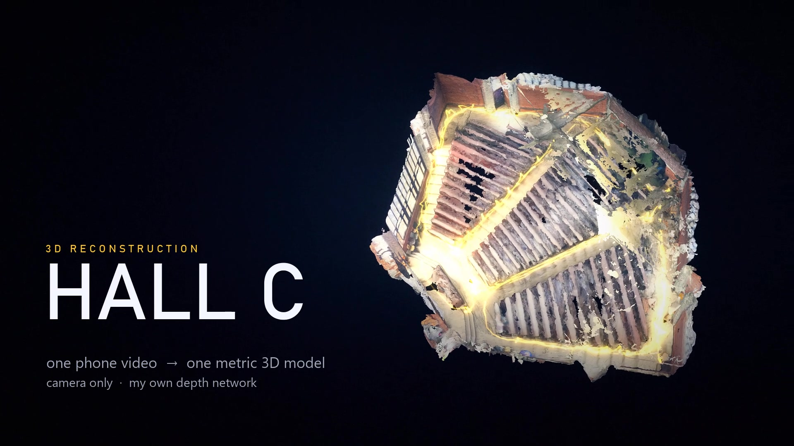

# Hall C: metric 3D reconstruction from one phone video, with my own depth network

One 11-minute HDR phone walk through a lecture hall became a 9.1 M-triangle model.
Camera only. The dense geometry comes from a monocular depth CNN I trained myself
(EfficientNet-B2 encoder, ImageNet-pretrained, 20.66 M parameters in total), fused with
COLMAP stereo and camera poses.

## Try the model
**Model download: MODEL_LINK_HERE**

One RGB image in, a metric depth map out.

## Measured results
Rendered from each frame's exact camera and compared with the photo (60 views over the whole walk):

| | old mesh | final mesh |
|---|---|---|
| median misalignment vs photos | 3.5 px | **1.8 px** |
| share of the photo covered | 82% | **97%** |
| agreement with stereo-measured depth | - | 94.7% |

- 1,110 solved cameras, 380.8 m of path, 0.94 px mean reprojection error.
- Surface by source (area, re-measured on the final mesh): 18% stereo, 42% stereo carried over, 30% network, 10% interpolated.
- Hall fine-tune of the network: median depth error vs stereo on 70 held-out frames 24.2% -> 10.2% (89% of frames improved).
- NYU AbsRel by version, raw metric depth (every 3rd test image): V1 0.164, V3 0.128, V11 0.126. It barely moves after V3;
  later versions fixed geometry and multi-view consistency (held-out cross-view error V10 12.5% -> V11 11.6%).

## Honest limits
- Scale comes from the network's metric depth via SfM anchors, not from a tape measure.
- 10% of the surface is interpolated (Poisson bridge, within 60 cm of measured surface). Glass is wavy; dark glossy benches are the weakest area.
- The hall fine-tune is near-field only (stereo stops at 10 m) and specific to this hall and phone.

## About this repo
Only the model and this description are public. The training and reconstruction code is not published.
